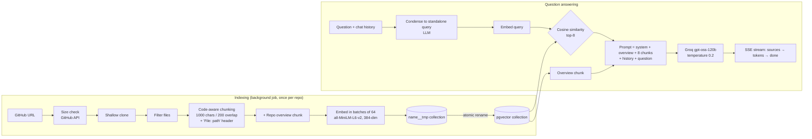
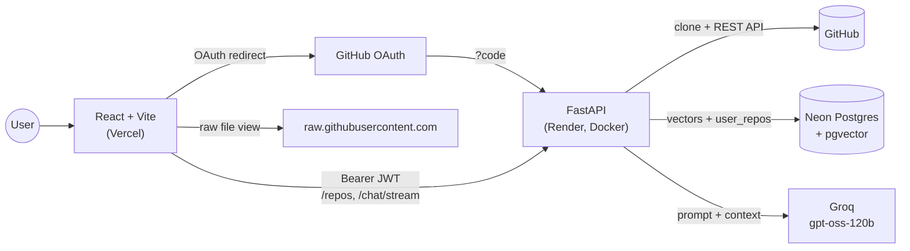

# GitHub-GPT — Chat with any GitHub repository (RAG)


Ask natural-language questions about any public GitHub repository and get answers grounded in its actual source code, with the source files cited. Built as a Retrieval-Augmented Generation (RAG) pipeline: FastAPI + LangChain + pgvector + Groq LLM, React frontend, GitHub OAuth login, per-user workspaces.

|                    | Link                                            |
| ------------------ | ----------------------------------------------- |
| Web app            | https://github-gpt-using-rag.vercel.app         |
| API docs (Swagger) | https://github-gpt-api-c13y.onrender.com/docs   |
| Health check       | https://github-gpt-api-c13y.onrender.com/health |

> Backend runs on Render free tier: it sleeps after 15 min idle, first request can take ~50 s (cold start).

---

## Contents

1. [Features](#features)
2. [RAG Pipeline](#rag-pipeline)
3. [Architecture](#architecture)
4. [Tech Stack](#tech-stack)
5. [Authentication & Multi-user Model](#authentication--multi-user-model)
6. [Project Structure](#project-structure)
7. [Local Setup](#local-setup)
8. [Environment Variables](#environment-variables)
9. [API Reference](#api-reference)
10. [Deployment](#deployment)
11. [Design Decisions](#design-decisions)
12. [Limits & Performance](#limits--performance)
13. [Known Limitations](#known-limitations)
14. [Future Improvements](#future-improvements)
15. [Contributors](#contributors)

---

## Features

**Indexing**

- Index any public GitHub repo by URL (shallow `git clone --depth 1`).
- **Asynchronous background indexing** — `POST /repos` returns `202 Accepted` immediately; the client polls job status every 2 s and shows a live progress bar (stage + `embedded/total` chunks).
- **Pre-clone size check** via GitHub REST API — repos > 150 MB are rejected in ~1 s, before download.
- **Atomic indexing** — vectors are written to a temporary `<name>__tmp` collection and renamed only on success; a crash never leaves a half-indexed repo.
- **Code-aware chunking** — language-specific separators (class/function boundaries) for 15 languages via LangChain `RecursiveCharacterTextSplitter.from_language`.
- **Repo overview chunk** — description, topics, stars, contributors (with commit counts), languages, full file list and README head; always injected into context.
- **File filtering** — skips `node_modules`, `dist`, `build`, `vendor`, `target`, `.venv`, lockfiles, minified files (`*.min.js`, `*.map`) and files > 200 KB.
- **Batched embedding** (64 chunks/batch) with a global lock (one indexing job at a time) to stay under 512 MB RAM.

**Question answering**

- Semantic search (cosine similarity, top-k = 8) over the repo's pgvector collection.
- **Streaming answers** via Server-Sent Events (token by token, with a Stop button).
- **Conversation memory** — follow-ups are rewritten into standalone questions (query condensation) before retrieval; last 6 messages passed to the LLM.
- **Grounded prompt** — answers only from retrieved context; multi-part questions are answered part by part, missing parts are stated explicitly.
- **Source citations** — every answer lists the files used; click to open the file in an in-app viewer with syntax highlighting (fetched from `raw.githubusercontent.com`).
- Markdown rendering with GitHub-flavoured tables (`remark-gfm`) and highlighted code blocks.

**Users**

- **Sign in with GitHub** (OAuth 2.0, `read:user` scope) — stateless JWT sessions.
- **Per-user workspaces** — each user sees and chats with only the repos they added; repo list is stored server-side and follows the user across devices.
- **Shared vector cache** — if any user already indexed a repo, other users get it linked instantly (no re-embedding, no duplicate storage).
- The signed-in user's public GitHub repos are shown as one-click suggestions.
- Per-user chat history in the browser (`localStorage`, keyed by GitHub login).

---

## RAG Pipeline



| Stage           | Implementation                                                                                                                                                                                                                                        |
| --------------- | ----------------------------------------------------------------------------------------------------------------------------------------------------------------------------------------------------------------------------------------------------- |
| Ingestion       | `GitPython` shallow clone into OS temp dir (`/tmp/ghgpt-repos`), deleted after indexing                                                                                                                                                               |
| Filtering       | Allow-list of 29 extensions + `README`, `LICENSE`, `Dockerfile`, `Makefile`; ignore-list of build/dependency dirs and lockfiles; max 200 KB per file                                                                                                  |
| Chunking        | `RecursiveCharacterTextSplitter.from_language()` (Python, JS, TS, Java, Go, Rust, C, C++, C#, Kotlin, PHP, Ruby, Swift, Markdown, HTML); fallback recursive splitter; `chunk_size=1000`, `chunk_overlap=200`; each chunk prefixed with `File: <path>` |
| Overview        | One synthetic chunk (`source="__overview__"`) built from GitHub API (`/repos`, `/contributors`, `/languages`) + file tree + first 1500 chars of README                                                                                                |
| Embedding       | `sentence-transformers/all-MiniLM-L6-v2` via **fastembed** (ONNX Runtime, 1 thread), L2-normalized 384-dim vectors                                                                                                                                    |
| Storage         | `langchain-postgres` `PGVector` (JSONB metadata: `source`, `chunk_index`), one collection per repo                                                                                                                                                    |
| Retrieval       | Similarity search `k=8` + overview chunk always prepended; overview hidden from citations                                                                                                                                                             |
| Query rewriting | Condense prompt turns follow-ups ("where is it called?") into standalone queries; falls back to raw question on failure                                                                                                                               |
| Generation      | `ChatGroq(model="openai/gpt-oss-120b", temperature=0.2)` with LCEL chain: `ChatPromptTemplate → LLM → StrOutputParser`                                                                                                                                |
| Memory          | Last 6 messages, each truncated to 1500 chars                                                                                                                                                                                                         |
| Streaming       | `StreamingResponse` with SSE events `sources`, `token`, `done`, `error`                                                                                                                                                                               |

---

## Architecture



---

## Tech Stack

| Layer         | Technology                                                                                                               |
| ------------- | ------------------------------------------------------------------------------------------------------------------------ |
| Frontend      | React 18, TypeScript 5, Vite 5, Tailwind CSS 3 (+ typography), react-markdown 9 + remark-gfm, highlight.js, lucide-react |
| Backend       | Python 3.12, FastAPI, Uvicorn, Pydantic v2 + pydantic-settings, BackgroundTasks                                          |
| RAG framework | LangChain (`langchain-text-splitters`, `langchain-core` LCEL, `langchain-postgres`, `langchain-groq`)                    |
| Embeddings    | `all-MiniLM-L6-v2` via fastembed (ONNX, no PyTorch)                                                                      |
| Vector DB     | PostgreSQL + pgvector on Neon (serverless), SQLAlchemy + psycopg 3                                                       |
| LLM           | Groq — `openai/gpt-oss-120b`                                                                                             |
| Auth          | GitHub OAuth 2.0 (authorization-code flow), PyJWT (HS256), httpx                                                         |
| Repo access   | GitPython, GitHub REST API                                                                                               |
| Hosting       | Vercel (frontend), Render (backend, Docker), Neon (DB); auto-deploy on push to `main`                                    |

---

## Authentication & Multi-user Model

**Login flow (GitHub OAuth 2.0)**

1. Frontend links to `GET /auth/github/login` → backend redirects to GitHub `authorize` with `client_id`, `redirect_uri`, `scope=read:user` and a signed, 10-minute `state` JWT (CSRF protection, no session store).
2. GitHub redirects to `GET /auth/github/callback?code&state` → backend verifies `state`, exchanges `code` for a GitHub access token, reads `/user`, then **discards the GitHub token**.
3. Backend issues its own JWT (`sub`=login, `name`, `avatar`, `exp`=7 days, HS256) and redirects to `FRONTEND_URL/#token=<jwt>` (URL fragment → never sent to servers or logs).
4. Frontend stores the token in `localStorage`, strips it from the URL, reads profile from the JWT payload and sends `Authorization: Bearer <jwt>` on every request. Expired/invalid token → `401` → back to sign-in.

**Data model**

```sql
CREATE TABLE user_repos (
    login           TEXT NOT NULL,          -- GitHub username
    collection_name TEXT NOT NULL,          -- pgvector collection (shared)
    repo_url        TEXT NOT NULL,
    files           INTEGER NOT NULL DEFAULT 0,
    chunks          INTEGER NOT NULL DEFAULT 0,
    indexed_at      TIMESTAMPTZ NOT NULL DEFAULT now(),
    PRIMARY KEY (login, collection_name)
);
```

- Vectors live in LangChain's `langchain_pg_collection` / `langchain_pg_embedding` tables, one collection per repo, **shared across users**.
- `user_repos` maps users to collections. Created automatically on startup.
- Indexing a repo already in the DB → linked to the user instantly. Indexing a repo currently being indexed by someone else → user is added to the job's `requested_by` list.
- Removing a repo deletes only the user's link; vectors are deleted when no user references the collection.
- Chat endpoints return `403` if the collection is not in the caller's list.

| Endpoint                                                                       | Auth       |
| ------------------------------------------------------------------------------ | ---------- |
| `/health`, `/auth/github/*`, `GET /repos/{name}/status`                        | Public     |
| `GET/POST /repos`, `DELETE /repos/{name}`, `/chat`, `/chat/stream`, `/auth/me` | Bearer JWT |

---

## Project Structure

```
github-GPT-using-RAG/
├── backend-v2/
│   ├── app/
│   │   ├── main.py               # FastAPI app, CORS, routers, startup (creates user_repos), /health
│   │   ├── core/
│   │   │   ├── config.py         # all settings (pydantic-settings, env / .env)
│   │   │   ├── auth.py           # JWT create/verify, current_user dependency
│   │   │   └── logging.py
│   │   ├── api/
│   │   │   ├── routes_auth.py    # /auth/github/login, /auth/github/callback, /auth/me
│   │   │   ├── routes_repo.py    # /repos: list, index (background job), status, remove
│   │   │   └── routes_chat.py    # /chat, /chat/stream (SSE)
│   │   ├── schemas/
│   │   │   ├── repo.py           # IndexRepoRequest, IndexJobStatus
│   │   │   └── chat.py           # ChatRequest, ChatResponse, ChatTurn
│   │   └── services/
│   │       ├── github_loader.py  # size-safe clone, file filtering, cleanup
│   │       ├── chunker.py        # code-aware chunking + "File:" headers
│   │       ├── overview.py       # repo overview chunk from GitHub API
│   │       ├── embeddings.py     # fastembed model singleton
│   │       ├── vectorstore.py    # PGVector, batched insert, delete, atomic rename
│   │       ├── retriever.py      # top-k search, overview lookup
│   │       ├── rag_chain.py      # condense → retrieve → prompt → Groq (sync + stream)
│   │       ├── jobs.py           # in-memory job registry + indexing lock
│   │       └── user_repos.py     # per-user repo list (SQL)
│   ├── Dockerfile                # python:3.12-slim + git, model pre-downloaded at build
│   ├── pyproject.toml
│   └── .env.example
├── frontend/
│   ├── src/
│   │   ├── App.tsx               # layout, auth state, per-user storage, chat streaming
│   │   ├── api/client.ts         # typed API client, auth header, job polling, SSE parser
│   │   ├── lib/
│   │   │   ├── auth.ts           # token storage, JWT payload decode, OAuth redirect handling
│   │   │   ├── repo.ts           # URL parsing, collection naming, GitHub raw/blob URLs
│   │   │   ├── storage.ts        # safe localStorage helpers
│   │   │   └── highlight.ts      # highlight.js setup
│   │   ├── components/
│   │   │   ├── IndexPanel.tsx    # repo URL input, user's repo suggestions, progress bar
│   │   │   ├── ChatView.tsx      # messages, streaming, sources, stop
│   │   │   ├── Sidebar.tsx       # repo list, referenced-file tree, user + sign out
│   │   │   ├── FileView.tsx      # source file viewer with line numbers
│   │   │   ├── Markdown.tsx      # react-markdown + remark-gfm + code blocks
│   │   │   ├── TabBar.tsx, StatusBar.tsx, CodeBlock.tsx, Logo.tsx
│   │   └── types/api.ts          # mirrors backend schemas
│   ├── vite.config.ts            # dev server on :3000
│   └── package.json
└── README.md
```

---

## Local Setup

**Prerequisites:** Python 3.12+, Node.js 18+, Git, a free [Neon](https://neon.tech) database, a free [Groq](https://console.groq.com/keys) API key, a GitHub OAuth App.

**1. Clone**

```bash
git clone https://github.com/Aditya09Goyal/github-GPT-using-RAG.git
cd github-GPT-using-RAG
```

**2. Database (once)** — in Neon SQL Editor:

```sql
CREATE EXTENSION IF NOT EXISTS vector;
```

**3. GitHub OAuth App (local)** — https://github.com/settings/applications/new

- Homepage URL: `http://localhost:3000`
- Authorization callback URL: `http://localhost:8000/auth/github/callback`
- Copy Client ID, generate Client secret.

**4. Backend**

```bash
cd backend-v2
cp .env.example .env          # fill values (see Environment Variables)
python -m venv .venv
.venv\Scripts\activate        # Windows  (macOS/Linux: source .venv/bin/activate)
pip install uv && uv pip install -r pyproject.toml
uvicorn app.main:app --reload --reload-dir app --port 8000
```

→ http://localhost:8000/docs

> Use `--reload-dir app`: watching the whole folder can restart the server mid-indexing.

**5. Frontend** (new terminal)

```bash
cd frontend
cp .env.example .env          # VITE_API_BASE_URL=http://localhost:8000
npm install
npm run dev
```

→ http://localhost:3000

Generate a JWT secret: `python -c "import secrets; print(secrets.token_urlsafe(48))"`

---

## Environment Variables

**Backend (`backend-v2/.env` locally, Render dashboard in production)**

| Variable               | Required | Local example                                      | Purpose                                                       |
| ---------------------- | -------- | -------------------------------------------------- | ------------------------------------------------------------- |
| `GROQ_API_KEY`         | yes      | `gsk_...`                                          | LLM                                                           |
| `DATABASE_URL`         | yes      | `postgresql://...neon.tech/neondb?sslmode=require` | Neon (direct, non-pooled)                                     |
| `CORS_ORIGINS`         | yes      | `http://localhost:3000,http://localhost:5173`      | Allowed frontend origins (comma-separated)                    |
| `GITHUB_CLIENT_ID`     | yes      | `Ov23li...`                                        | OAuth App                                                     |
| `GITHUB_CLIENT_SECRET` | yes      | —                                                  | OAuth App                                                     |
| `JWT_SECRET`           | yes      | 48+ random bytes                                   | Signs login tokens (≥ 32 bytes)                               |
| `BACKEND_URL`          | yes      | `http://localhost:8000`                            | Builds OAuth `redirect_uri`                                   |
| `FRONTEND_URL`         | yes      | `http://localhost:3000`                            | Post-login redirect                                           |
| `GITHUB_TOKEN`         | no       | `ghp_...`                                          | GitHub API rate limit 60 → 5000 req/h (overview + size check) |

**Frontend (`frontend/.env`, Vercel dashboard in production)**

| Variable            | Example                                   |
| ------------------- | ----------------------------------------- |
| `VITE_API_BASE_URL` | `http://localhost:8000` (no trailing `/`) |

**Tunables** (`config.py`, override via env): `CHUNK_SIZE`=1000, `CHUNK_OVERLAP`=200, `RETRIEVER_TOP_K`=8, `HISTORY_MAX_MESSAGES`=6, `HISTORY_MAX_CHARS`=1500, `MAX_REPO_MB`=150, `MAX_FILES`=1500, `MAX_CHUNKS`=8000, `EMBED_BATCH_SIZE`=64, `JWT_EXPIRE_DAYS`=7, `EMBEDDING_MODEL_NAME`, `REPO_CLONE_DIR`.

Local and production need **separate OAuth Apps** (a callback URL is bound to one host). Never commit `.env`.

---

## API Reference

| Method   | Endpoint                | Auth | Description                                                                                        |
| -------- | ----------------------- | ---- | -------------------------------------------------------------------------------------------------- |
| `GET`    | `/health`               | –    | Liveness → `{"status":"ok"}`                                                                       |
| `GET`    | `/auth/github/login`    | –    | Redirect to GitHub authorize page                                                                  |
| `GET`    | `/auth/github/callback` | –    | OAuth callback → redirect to frontend with `#token=` or `#auth_error=`                             |
| `GET`    | `/auth/me`              | JWT  | Current user `{login, name, avatar_url}`                                                           |
| `GET`    | `/repos`                | JWT  | Caller's repo list                                                                                 |
| `POST`   | `/repos`                | JWT  | Add/index repo → `202` + job (`done` immediately if already indexed)                               |
| `GET`    | `/repos/{name}/status`  | –    | Job status: `queued \| running \| done \| failed`, `stage`, `files`, `chunks`, `embedded`, `error` |
| `DELETE` | `/repos/{name}`         | JWT  | Remove from caller's list (vectors deleted when unreferenced)                                      |
| `POST`   | `/chat`                 | JWT  | Answer + sources (JSON)                                                                            |
| `POST`   | `/chat/stream`          | JWT  | Answer as SSE: `sources`, `token`…, `done` / `error`                                               |

**Index a repo**

```bash
curl -X POST $API/repos -H "Authorization: Bearer $JWT" -H "Content-Type: application/json" \
  -d '{"repo_url":"https://github.com/octocat/Hello-World","collection_name":"octocat-hello-world"}'
# 202 → {"collection_name":"octocat-hello-world","status":"queued","stage":"...","files":0,"chunks":0,"embedded":0,...}

curl $API/repos/octocat-hello-world/status
# {"status":"running","stage":"Embedding chunks…","files":31,"chunks":220,"embedded":128,...}
```

Body fields: `repo_url` (`https://github.com/owner/repo`), `collection_name` (3–63 chars, `[a-zA-Z0-9_-]`), `force` (bool, re-index; old copy replaced only on success).

**Ask (streaming)**

```bash
curl -N -X POST $API/chat/stream -H "Authorization: Bearer $JWT" -H "Content-Type: application/json" \
  -d '{"question":"Where is it used?","collection_name":"octocat-hello-world",
       "history":[{"role":"user","content":"What is in the README?"},{"role":"assistant","content":"Hello World"}]}'
```

```text
event: sources
data: {"sources": ["README"]}

event: token
data: {"content": "The"}
...
event: done
data: {}
```

| Status | Meaning                                                  |
| ------ | -------------------------------------------------------- |
| `202`  | Indexing job accepted                                    |
| `401`  | Missing / invalid / expired JWT                          |
| `403`  | Repo not in caller's list                                |
| `404`  | Collection or job not found (job lost on server restart) |
| `409`  | Repo is still being indexed (on delete)                  |
| `422`  | Invalid body (bad URL / collection name)                 |

Job `failed` errors: repo > 150 MB, > 1500 code files, > 8000 chunks, no indexable files, clone/embedding failure.

---

## Deployment

| Part     | Platform                      | Settings                                                                                                                     |
| -------- | ----------------------------- | ---------------------------------------------------------------------------------------------------------------------------- |
| Database | Neon (free)                   | `CREATE EXTENSION vector;`, direct connection string                                                                         |
| Backend  | Render (free, Docker)         | Dockerfile `backend-v2/Dockerfile`, build context `backend-v2`, health check `/health`, branch `main`, all backend env vars  |
| Frontend | Vercel (free)                 | Root `frontend`, preset Vite, `VITE_API_BASE_URL=https://github-gpt-api-c13y.onrender.com`                                   |
| OAuth    | GitHub OAuth App (production) | Homepage `https://github-gpt-using-rag.vercel.app`, callback `https://github-gpt-api-c13y.onrender.com/auth/github/callback` |

Production env on Render: `BACKEND_URL=https://github-gpt-api-c13y.onrender.com`, `FRONTEND_URL=https://github-gpt-using-rag.vercel.app`, `CORS_ORIGINS=https://github-gpt-using-rag.vercel.app`, production `GITHUB_CLIENT_ID/SECRET`, separate `JWT_SECRET`.

Push to `main` → Render and Vercel redeploy automatically. The embedding model is downloaded at Docker build time, so startup is fast.

---

## Design Decisions

- **Background jobs instead of a blocking request** — indexing used to run inside `POST /repos`; large repos hit OOM / connection drops on the 512 MB instance. Now: `202` + polling, which also keeps the free instance awake during indexing.
- **Temp collection + atomic rename** — a single SQL transaction swaps `<name>__tmp` → `<name>`; failures clean up the temp collection, so partial indexes never become visible.
- **Size check before clone** — GitHub API `size` rejects huge repos (e.g. cockroachdb/cockroach ≈ 1.1 GB) in ~1 s instead of after a long download.
- **Clone into OS temp dir, delete after indexing** — the frontend reads files from GitHub directly; clones only consumed disk and triggered `uvicorn --reload` restarts.
- **Code-aware chunking + `File:` header** — chunks align with functions/classes; path text in the chunk improves retrieval for file-specific questions.
- **Overview chunk always in context** — questions like "who contributed?", "what is this project?", "folder structure?" can't be answered by any single code chunk.
- **Query condensation** — vector search on "where is it called?" fails; the rewritten standalone query works.
- **Shared vectors, per-user links** — same public code is embedded once; `user_repos` gives isolation without duplicate storage on Neon's free tier.
- **Stateless JWT + signed OAuth `state`** — no session store or extra table for auth; GitHub token is never stored.
- **Token in URL fragment** — `#token=` is never sent to servers or written to access logs.
- **fastembed (ONNX) instead of PyTorch** — same MiniLM model, fraction of the RAM, fits the free instance.
- **pgvector instead of a local vector store** — free hosts have no persistent disk; Postgres survives restarts and redeploys.
- **Normalized embeddings** — cosine similarity measures meaning (direction), not chunk length.
- **One indexing job at a time, 64-chunk batches** — bounded peak memory on 512 MB.
- **Lockfiles / minified / > 200 KB files skipped** — `package-lock.json` alone was ~75 % of chunks with no useful knowledge.

---

## Limits & Performance

| Limit                  | Value        |
| ---------------------- | ------------ |
| Repo size (GitHub API) | 150 MB       |
| Indexable files        | 1500         |
| Chunks                 | 8000         |
| File size              | 200 KB       |
| Retrieved chunks       | 8 + overview |
| JWT lifetime           | 7 days       |

Peak RAM ~390 MB. Render's free CPU is slower than these numbers; small and medium repos work best.

---

## Known Limitations

- Public repositories only; default branch only.
- Job registry is in memory — a server restart loses running jobs (frontend reports it; re-index).
- One indexing job at a time (others wait as `queued`).
- Chat history is stored per browser (repo list is server-side, chats are not).
- Overview metadata uses the unauthenticated GitHub API (60 req/h) unless `GITHUB_TOKEN` is set.
- No automatic re-index when the source repo changes (`force: true` via API only).
- No retrieval-quality evaluation yet.

---

## Future Improvements

- **Evaluation harness** — question set with known answers; measure Hit@k, MRR and LLM-judged answer correctness; compare chunking strategies, chunk sizes and k.
- **Hybrid retrieval** — Postgres full-text (BM25-style) + vector search with Reciprocal Rank Fusion; better for exact identifiers.
- **Re-ranking** — retrieve ~20, re-rank with a cross-encoder, send top 6.
- **Structural metadata** — store class/function name and line range per chunk → line-level citations (`file.py#L10-L40`) and path/language filters.
- **Better ingestion** — Jupyter notebooks (code/markdown cells), PDFs in `docs/`, skip generated code (protobuf, migrations).
- **Retrieval debug view** — show retrieved chunks and similarity scores per answer.
- **Server-side chat history** — chats follow the user across devices.
- **Re-index button & auto-refresh** on new commits (GitHub webhooks).
- **Private repos & branch selection** using the user's OAuth token (`repo` scope).
- **Persistent job queue** (Postgres/Redis) so jobs survive restarts; parallel workers on paid tier.
- **Model switcher** — compare Groq / Gemini models side by side.

---

## Contributors

| Name          | GitHub                                             |
| ------------- | -------------------------------------------------- |
| Aditya Goyal  | [@Aditya09Goyal](https://github.com/Aditya09Goyal) |
| Satvik Vansh  | [@satvikxvansh](https://github.com/satvikxvansh)   |
